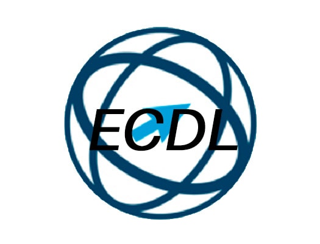
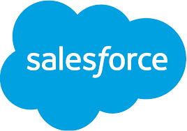

# 👋 ¡Hola! Soy María Rosete Suárez

## 👩‍💻 Sobre mí

💻 Desarrolladora **Full Stack Junior** | Backend y Frontend  
🎯 Apasionada por crear soluciones tecnológicas útiles, escalables y centradas en el usuario.

🎓 Me formé en Administración de Sistemas Informáticos y me especialicé en Aplicaciones Web y Multiplataforma. Disfruto aprendiendo nuevas tecnologías y enfrentando retos que potencien mi crecimiento como desarrolladora.

---
## 📜 Certificados

  
  
  
  
  
  
  
  

- **Curso de MongoDB: Creación y gestión de bases de datos NoSQL**  
  *OpenWebinars · Mar. 2025*

- **Learning the Basics of ABAP Programming on SAP BTP**  
  *SAP · Ene. 2025*

- **NodeJS: De cero a experto**  
  *Udemy · May. 2024*

- **Certificado profesional en Soporte de Tecnologías de la Información de Google**  
  *Coursera *

- **Acreditación de competencias digitales europeas ECDL**  
  *ECDL Spain *

- **Certificado Servidor Web Apache 2.4**  
  *OpenWebinars *

- **Certificado de profesionalidad nivel 3 “Seguridad Informática”**  
  *ASATA *

- **Curso de Seguridad Informática en la Gestión Empresarial**  
  *Dicampus *

- **Salesforce (varios cursos, 2024):**  
  - Fundamentos de Salesforce Platform  
  - Gestión de datos  
  - Informes y paneles de Lightning Experience  
  - Modelado de datos  
  - Participación de usuario  
  - Personalización de Lightning Experience

---

## 💼 Experiencia profesional

He trabajado como **Desarrolladora Full Stack Jr** en entornos reales, participando en soluciones empresariales con stacks modernos:

🏢 **ASP.NET Core (.NET 9) + React (Vite + Tailwind)**  
*Clarcat · mar. 2025 – jun. 2025*

- Aplicación de arquitectura basada en **API REST**, con diseño de controladores y lógica de negocio orientada a servicios.
  
- Desarrollo de interfaces modernas y responsive con **React**, **Vite** y **Tailwind CSS**.
  
- Documentación de endpoints con **Swagger**.
  
- Uso de **Git** y **Azure DevOps** para control de versiones y despliegue continuo.
  
- Gestión de datos estructurados con **MySQL**.

🏢 **Node.js + Vue.js**  
*Ticmedia · abr. 2024 – jun. 2024*

- Backend con **Node.js** y **Express.js**, incluyendo autenticación con **JWT**.
  
- Desarrollo de interfaz dinámica y responsive con **Vue.js** y **Quasar Framework**.
  
- Modelado de documentos y gestión de datos con **MongoDB** y **Mongoose**.
  
- Funcionalidades implementadas: visor de facturas con descarga en PDF, listado de noticias con paginación, banner configurable y gestión interna de usuarios, clientes y facturas.

Estas experiencias me han permitido aplicar buenas prácticas de desarrollo, trabajar en equipo y construir soluciones escalables con tecnologías actuales del ecosistema web.

---

## 🎓 Proyectos académicos

- 🚀 He desarrollado plataformas completas con **Java + Spring Boot** y apps móviles con **Kotlin**, implementando:
  
  - Autenticación y gestión de usuarios.
  - Paneles de administración.
  - Control de actividades y reservas en tiempo real.
  - Soporte al usuario.

- 🏆 Mis TFGs fueron reconocidos con menciones honoríficas:
  
  - **SkillTech**, plataforma educativa web para la gestión de cursos y materiales didácticos.
    
  - **Asgard Gym**, app Android para la organización de actividades en centros deportivos.

Ambos proyectos destacan por su diseño funcional, enfoque práctico y orientación al usuario final.

---

## 🚀 Proyectos destacados

 

### 📱 [Asgard Gym – App móvil para gimnasios](https://github.com/mariarosete/asgardGym)

Aplicación Android desarrollada para facilitar la gestión de actividades en centros deportivos.

🔹 Permite a los usuarios:
- Consultar una agenda semanal filtrable por tipo, nombre o monitor.
- Realizar reservas en tiempo real con validación automática.
- Ver el historial de reservas y estadísticas personales.

🔹 Para el personal del gimnasio:
- Gestión de usuarios, actividades e historial de cambios.

🛠️ **Tecnologías:** Kotlin · Android Studio · SQLite · Material Design 

📍 *Próximas mejoras:* sincronización con API REST y análisis de hábitos saludables

---

 

### 💻 [SkillTech – Plataforma web educativa](https://github.com/mariarosete/skillTech)

Plataforma web para la gestión de cursos y recursos educativos, dirigida a estudiantes y profesionales de informática.

🔹 Para administradores:
- Crear, editar y eliminar cursos, usuarios y materiales (PDF, enlaces, vídeos).
- Visualizar y responder solicitudes de soporte de usuarios.

🔹 Para alumnos:
- Registro con rol asignado (alumno o administrador).
- Acceso a cursos y materiales.
- Edición de perfil y envío de tickets de soporte.

🛠️ **Tecnologías:** Java · Spring Boot · MySQL · JWT · JavaScript · HTML · CSS

---

 

### 🎮 [Pokedex – Aplicación web Angular](https://github.com/mariarosete/pokedex)

Aplicación desarrollada durante una formación especializada en Angular, enfocada en el consumo de APIs y la gestión de estado con NgRx.
Los datos se obtienen en tiempo real desde la API pública PokeAPI.

🔹 Funcionalidades:
- Búsqueda y filtrado de Pokémon por tipo (agua, fuego, planta...).
- Vista de listado y detalle individual con información enriquecida.
- Interfaz responsiva con diseño moderno.

🛠️ **Tecnologías:** Angular · NgRx · RxJS · Angular Material · TypeScript

📍 *Proyecto realizado como parte de una formación intensiva en Angular*

---

## 💡 Tecnologías que uso

### 🧠 Lenguajes

---

### 🚀 Frameworks

---
### 🧩 Librerías

### 🗄️ Bases de datos

#### SQL

#### NoSQL

---

### 🛠️ Herramientas

## 📩 Contacto

  
  
  

---

> *“Soy una persona responsable, resolutiva y con gran capacidad de adaptación. Me motiva especialmente seguir aprendiendo y asumir nuevos retos en el desarrollo de software.”*

