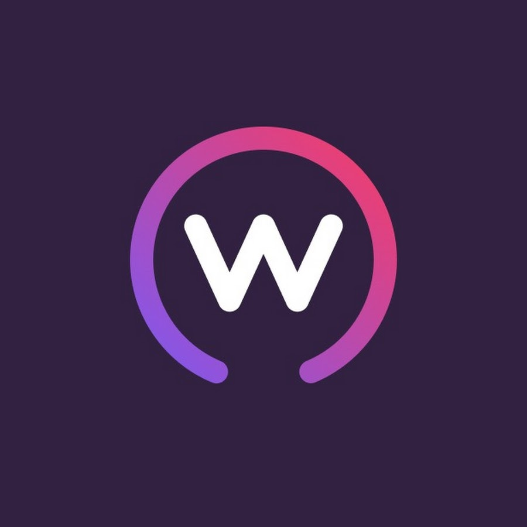
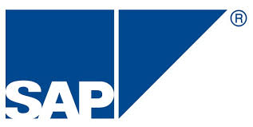
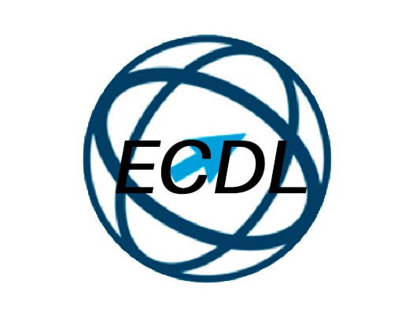
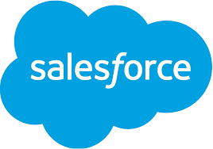

  🌐 <strong>Visita mi nuevo portafolio personal:</strong> 
  <a href="https://mariarosete.vercel.app/" target="_blank">https://mariarosete.vercel.app/</a>

# 👋 ¡Hola! Soy María Rosete Suárez

## 👩‍💻 Sobre mí

🔹 Desarrolladora Full Stack Junior especializada en .NET (ASP.NET Core) y React

🔹 Apasionada por crear soluciones tecnológicas útiles, escalables y centradas en el usuario, con especial foco en aplicaciones web modernas.

🔹 Me formé en Administración de Sistemas Informáticos y me especialicé en Aplicaciones Web y Multiplataforma.

🔹 Enfocada en proyectos Full Stack con backend sólido y frontend moderno, aplicando buenas prácticas y orientación a producto.

---

## 📄 Descargar CV

  

---

## Tabla de contenidos

- [👩‍💻 Sobre mí](#-sobre-mí)
- [📄 Descargar CV](#-descargar-cv)
- [🎓 Educación](#-educación)
- [📜 Certificados](#-certificados)
- [💼 Experiencia profesional reciente](#-experiencia-profesional-reciente)
- [🎓 Proyectos académicos](#-proyectos-académicos)
- [🚀 Proyectos destacados](#-proyectos-destacados)
- [💡 Tecnologías que uso](#-tecnologías-que-uso)
- [📩 Contacto](#-contacto)
- [📊 Estadísticas de GitHub](#-estadísticas-de-github)

---
## 🎓 Educación

- **CFGS Desarrollo de Aplicaciones Multiplataforma**  
  *IES Número 1 Gijón*  
  *sept. 2024 – jun. 2025*

- **CFGS Desarrollo de Aplicaciones Web**  
  *CIFP La Laboral*  
  *sept. 2022 – jun. 2024*

- **CFGS Administración de Sistemas Informáticos**  
  *IES Número 1 Gijón*  
  *sept. 2009 – jun. 2011*

---
## 📜 Certificados

  
  
  
  
  
  
  
  
  

- **Micro-Certification – Welcome to ServiceNow**  
  *ServiceNow · Feb. 2026*  
  [Ver credencial](https://www.linkedin.com/in/mariarosetesuarez/overlay/1771586252483/single-media-viewer/?profileId=ACoAAEr-PaoBY5xohXS4VTc50eGRdX1PM-ImnOo)

- **Foundational C# with Microsoft**  
  *Freecodecamp · Dic. 2025*  
  [Ver credencial](https://freecodecamp.org/certification/fcc-8f71be83-65d7-40d2-95e3-e4bca09cd50a/foundational-c-sharp-with-microsoft)

- **Curso de Angular: Ampliando Conceptos**  
  *OpenWebinars · Jul. 2025*  
  [Ver credencial](https://openwebinars.net/cert/62se)

- **Curso de .NET Framework**  
  *OpenWebinars · Jul. 2025*  
  [Ver credencial](https://openwebinars.net/cert/lWvO)

- **Curso de Fundamentos de React**  
  *OpenWebinars · Jul. 2025*  
  [Ver credencial](https://openwebinars.net/cert/q9Yr)

- **Curso de MongoDB: Creación y gestión de bases de datos NoSQL**  
  *OpenWebinars · Mar. 2025*  
  [Ver credencial](https://openwebinars.net/certificacion/0QCj1YwR)

- **Learning the Basics of ABAP Programming on SAP BTP**  
  *SAP · Ene. 2025*  
  [Ver credencial](https://www.credly.com/badges/0d749aff-8745-4737-abb0-90058a1ca0bb)

- **Perfil Trailhead de Salesforce – Insignias y Rutas Completadas**  
  *Salesforce · Ene. 2025*  
  [Ver perfil](https://www.salesforce.com/trailblazer/dvpl9jhprurtdm3g7i)

- **Certificado Servidor Web Apache 2.4**  
  *OpenWebinars · Nov. 2023*  
  [Ver credencial](https://openwebinars.net/cert/PuCz)

- **Certificado profesional en Soporte de Tecnologías de la Información de Google**  
  *Coursera · Ago. 2022*  
  [Ver credencial](https://www.coursera.org/account/accomplishments/professional-cert/WU7LEUWZ8FLE)

- **Certificado de profesionalidad nivel 3 “Seguridad Informática”**  
  *ASATA · Dic. 2018*  
  **ID de la credencial:** 03/18/00004962/IFCT0109

- **Acreditación de competencias digitales europeas ECDL**  
  *ECDL Spain · Dic. 2017*  
  **ID de la credencial:** ES004660

- **Curso de Seguridad Informática en la Gestión Empresarial**  
  *Dicampus · 2017*  
  **ID de la credencial:** PLF 2017/165

---

## 💼 Experiencia profesional reciente 

He trabajado como **Desarrolladora Full Stack Jr** en entornos reales, participando en soluciones empresariales con stacks modernos:

🏢 **ASP.NET Core (.NET 9) + React (Vite + Tailwind)**  
*Clarcat Cantábrico S.L. · mar. 2025 – jun. 2025*

- **Backend:** Desarrollé y optimicé una API REST en .NET 9 / ASP.NET Core, asegurando escalabilidad y mantenibilidad del sistema.
  
- **Frontend:** Implementé interfaces modernas y responsive con React, Vite y Tailwind CSS, mejorando la usabilidad y la experiencia de usuario.
  
- **Persistencia:** Consolidé las migraciones de Entity Framework en una única versión para MySQL, facilitando el mantenimiento y mejorando la estabilidad de la base de datos.
  
- **Calidad:** Aumenté la calidad del software mediante pruebas unitarias con MSTest, reduciendo errores en producción.
  
- **Colaboración:** Gestioné repositorios con Git y Azure DevOps, creando PRs para revisión y validación que facilitaron integraciones más ágiles y seguras.  
  
🏢 **Node.js + Vue.js**  
*Ticmedia Soluciones Profesionales, S.L. · mar. 2024 – jun. 2024*

- **Backend:** Desarrollé un backend con Node.js + Express.js, implementando API REST con autenticación JWT para un sistema de gestión interna.
  
- **Frontend:** Construí una interfaz dinámica y modular con Vue.js + Quasar Framework, optimizando la experiencia del usuario y mejorando la mantenibilidad del código.
  
- **Persistencia:** Gestioné datos con MongoDB/Mongoose, reforzando la seguridad y la consistencia del sistema.
  
- **Funcionalidades implementadas:** Implementé funcionalidades clave: visor de facturas en PDF, listado de noticias con paginación y gestión interna de usuarios y clientes.
  
- **Colaboración:** Mejoré la colaboración y control de versiones mediante GitHub y buenas prácticas ágiles, fomentando un desarrollo más ordenado y eficiente.

Estas experiencias me han permitido aplicar buenas prácticas de desarrollo, trabajar en equipo y construir soluciones escalables con tecnologías actuales del ecosistema web.

---

## 🎓 Proyectos académicos

- 🚀 He desarrollado plataformas completas con **Java + Spring Boot** y apps móviles con **Kotlin**, implementando:
  
  - Autenticación y gestión de usuarios.
  - Paneles de administración.
  - Control de actividades y reservas en tiempo real.
  - Soporte al usuario.

- 🏆 Mis TFGs fueron reconocidos con menciones honoríficas:
  
  - **SkillTech**, plataforma educativa web para la gestión de cursos y materiales didácticos.
    
  - **Asgard Gym**, app Android para la organización de actividades en centros deportivos.

Ambos proyectos destacan por su diseño funcional, enfoque práctico y orientación al usuario final.

---

## 🚀 Proyectos destacados

 

### 📱 [Asgard Gym – App móvil para gimnasios](https://github.com/mariarosete/asgardGym)

Aplicación Android desarrollada para facilitar la gestión de actividades en centros deportivos.

🔹 Permite a los usuarios:
- Consultar una agenda semanal filtrable por tipo, nombre o monitor.
- Realizar reservas en tiempo real con validación automática.
- Ver el historial de reservas y estadísticas personales.

🔹 Para el personal del gimnasio:
- Gestión de usuarios, actividades e historial de cambios.

**🛠️ Tecnologías**  

   

📍 *Incluye vídeo demostrativo en mi portafolio:* https://mariarosete.vercel.app/assets/AsgardGym-DimlY--h.mp4 
📍 *Próximas mejoras:* sincronización con API REST y análisis de hábitos saludables

---

 

### 💻 [SkillTech – Plataforma web educativa](https://github.com/mariarosete/skillTech)

Plataforma web para la gestión de cursos y recursos educativos, dirigida a estudiantes y profesionales de informática.

🔹 Para administradores:
- Crear, editar y eliminar cursos, usuarios y materiales (PDF, enlaces, vídeos).
- Visualizar y responder solicitudes de soporte de usuarios.

🔹 Para alumnos:
- Registro con rol asignado (alumno o administrador).
- Acceso a cursos y materiales.
- Edición de perfil y envío de tickets de soporte.

**🛠️ Tecnologías**  

📍 *Incluye vídeo demostrativo en mi portafolio:* https://mariarosete.vercel.app/assets/skillTech-CbHMBt_u.mp4

---

 

### 🎮 [Pokedex – Aplicación web Angular](https://github.com/mariarosete/pokedex)

Aplicación desarrollada durante una formación especializada en Angular, enfocada en el consumo de APIs y la gestión de estado con NgRx.
Los datos se obtienen en tiempo real desde la API pública PokeAPI.

🔹 Funcionalidades:
- Búsqueda y filtrado de Pokémon por tipo (agua, fuego, planta...).
- Vista de listado y detalle individual con información enriquecida.
- Interfaz responsiva con diseño moderno.

**🛠️ Tecnologías**  

📍 *Incluye vídeo demostrativo en mi portafolio:* https://mariarosete.vercel.app/assets/Pokedex-CnSHgZBe.mp4 
📍 *Proyecto realizado como parte de una formación intensiva en Angular*

---

### 📁 [Servidor de Archivos – Cliente Android + Servidor TCP](https://github.com/mariarosete/servidorArchivos)

Aplicación de gestión de archivos en red local desarrollada con una interfaz Android moderna en **Kotlin** y un servidor TCP en **Java**.  
Permite subir, descargar y visualizar archivos desde un dispositivo móvil conectado a la misma red.

🔹 **Funciones principales:**
- Listado dinámico de archivos disponibles en el servidor.
- Descarga de ficheros seleccionados desde un Spinner.
- Subida de cualquier tipo de archivo mediante el selector del sistema.
- Indicador del archivo actualmente seleccionado.
- Interfaz moderna basada en Material Design con estilos personalizados.
- Soporte para múltiples tipos de archivo (`.pdf`, `.jpg`, `.png`, `.txt`, `.mp4`, etc.).
- Botón de reinicio que limpia los campos y restablece el estado inicial.

🔸 **Gestión de errores incluida:**
- Validaciones para selección de archivo nula.
- Mensajes claros al usuario con Toast informativos.
- Control de flujo según respuestas del servidor TCP.

**🛠️ Tecnologías**

📍 *Incluye vídeo demostrativo en mi portafolio:* https://mariarosete.vercel.app/assets/Servidor-I_unzXxa.mp4 
📍 *Proyecto desarrollado de forma integral, incluyendo el frontend Android y el backend en Java para comunicación mediante sockets.*

---

### 🌐 [Portafolio Personal – React + Vite + TailwindCSS](https://github.com/mariarosete/portafolio)

Portafolio personal desarrollado para centralizar y presentar mis proyectos, experiencia y habilidades como desarrolladora **Full Stack**.  
Cuenta con un diseño moderno, animaciones fluidas y una interfaz totalmente responsive.  

🔹 **Características principales:**  
- Presentación completa de mis proyectos destacados, experiencia, formación y certificaciones.  
- Diseño limpio, minimalista y adaptable a cualquier dispositivo.  
- Animaciones suaves con **Framer Motion**.  
- Sección de contacto funcional con validación de formulario.  
- Enlaces directos a mis redes profesionales.  

**🛠️ Tecnologías**  

📍 *Proyecto desplegado en [Vercel](https://mariarosete.vercel.app/) con actualizaciones automáticas desde GitHub.*

---

### 📒 [Agenda de Contactos – Node.js + JavaScript + HTML + CSS](https://github.com/mariarosete/agenda-contactos)

Aplicación web desarrollada para la **gestión de contactos personales y profesionales**, con un enfoque en la simplicidad, la interactividad y el diseño propio sin frameworks de frontend.  
Permite crear, editar, eliminar y buscar contactos de manera dinámica, además de mostrar estadísticas visuales mediante gráficos.

🔹 **Características principales:**  
- Listado interactivo con ordenación por **nombre, apellidos y ciudad**.  
- **Búsqueda instantánea** y **filtros rápidos** (todos / favoritos).  
- **CRUD completo** con modales personalizados (agregar, editar, eliminar).  
- **Paginación en cliente** y almacenamiento de favoritos.  
- **Gráficos** dinámicos con **Chart.js**.  
- Interfaz **accesible y moderna**, creada sin frameworks CSS.  
- Configuración mediante archivo **`.env`** para conexión a base de datos MySQL.  

**🛠️ Tecnologías**  

📍 *Incluye vídeo demostrativo en mi portafolio:* https://mariarosete.vercel.app/assets/agenda-Bt2Pe7ie.mp4 
📍 *Proyecto ejecutable localmente mediante Node.js y npm, con configuración de entorno a través de archivo `.env`.*

---

### 🍰 [Pastelería Creativa – Aplicación de escritorio en Java Swing](https://github.com/mariarosete/pasteleriaCreativa)

Aplicación de escritorio desarrollada en **Java Swing** para crear y gestionar recetas de repostería desde una interfaz visual e intuitiva.  
Permite definir postres, añadir ingredientes, guardar y cargar recetas desde archivos de texto, personalizar la interfaz y acceder a una ayuda integrada con **JavaHelp**.

🔹 **Características principales:**  
- Creación de recetas: **nombre**, **tipo** y **categoría**.  
- Gestión dinámica de ingredientes con **menú contextual** (clic derecho) y opción de **limpiar todos**.  
- Guardar/cargar recetas y **generar archivo de texto** con todas las recetas.  
- Personalización del **color del texto** en paneles de postres e ingredientes.  
- **JavaHelp** integrado (acceso desde menú, barra de herramientas y tecla **F1**).  
- Componentes personalizados (botón corazón y paneles con bordes redondeados/sombra).

**🛠️ Tecnologías**  

📍 *Incluye vídeo demostrativo en mi portafolio:* https://mariarosete.vercel.app/assets/pasteleria-D-NwjL4p.mp4

---

### 🧁 [Pastelería Creativa – FlowDocument + DataGrid (WPF)](https://github.com/mariarosete/pasteleria)

Proyecto desarrollado en **WPF (C#)** orientado al mundo de la **pastelería creativa**.  
Incluye un **FlowDocument** interactivo con secciones formateadas e imágenes, y un módulo de **acceso a datos** con **DataGrid** y operaciones **CRUD** conectado a una base de datos **Microsoft Access** (`recetas.accdb`).

🔹 **Características principales:**  
- FlowDocument con secciones: **Recetas**, **Postres** y **Decoraciones**.  
- Acciones: **guardar**, **cargar**, **eliminar** e **imprimir** el documento.  
- Interactividad con **triggers** (hover en botones) y **eventos** (clic en imágenes).  
- Formato avanzado: columnas, listas, tablas (con combinación de celdas), imágenes flotantes/en línea e hipervínculos.  
- DataGrid con **CRUD completo** (insertar/modificar/eliminar) y navegación por registros.  
- Estilos y animaciones WPF aplicados a botones y ventana.

**🛠️ Tecnologías**  

📍 *Incluye vídeo demostrativo en mi portafolio:* https://mariarosete.vercel.app/assets/flowDocument-BkDYHWvr.mp4  
📍 *Proyecto ejecutable desde Visual Studio. La base de datos se encuentra en `recetas.accdb`.*

---

### 🎮 [¿Quién es este personaje de Disney? – Drag & Drop Game (HTML · CSS · JavaScript)](https://github.com/mariarosete/disney-drag-drop)

Proyecto frontend desarrollado con **HTML, CSS y JavaScript (Vanilla)**, centrado en la implementación de la **Drag & Drop API**, lógica de juego, carga dinámica de datos y experiencia de usuario.

El proyecto consiste en un **juego interactivo** donde el usuario debe asociar correctamente personajes de Disney con sus nombres, recibiendo **feedback visual inmediato** y pudiendo consultar **información detallada** de cada personaje.

🔹 **Características principales:**  
- Juego **Drag & Drop** con personajes de Disney.  
- Selección de **4 personajes aleatorios** en cada partida.  
- Validación visual:
  - ✔️ Correcto → se marca en verde y se bloquea.  
  - ❌ Incorrecto → se marca en rojo de forma temporal.  
- Verificación automática de victoria y **mensaje final de enhorabuena**.  
- Botón **Reiniciar** para generar una nueva combinación.  
- Vista alternativa de **información de personajes**:
  - Fichas con imagen, nombre y descripción.
  - Animación tipo **flip** para mostrar información adicional.  
- Carga dinámica de datos desde archivo **JSON** mediante `fetch`.  
- Código modular y organizado en funciones reutilizables.

**🛠️ Tecnologías**  

📍 *Incluye vídeo demostrativo en mi portafolio:* https://mariarosete.vercel.app/assets/disney-a0aX88cA.mp4   
📍 *Proyecto ejecutable directamente en el navegador (HTML + JS Vanilla).*   
📍 *Ideal para practicar lógica de juego, Drag & Drop y manipulación del DOM sin frameworks.*

---

### 🖍️ [DigiDraw – Pizarra Digital con Canvas (HTML · CSS · JavaScript)](https://github.com/mariarosete/digidraw-pizarra)

Proyecto frontend desarrollado con **HTML, CSS y JavaScript (Vanilla)**, centrado en el uso del **Canvas API**, dibujo interactivo, manipulación de imágenes y texto, y una experiencia de usuario visual e intuitiva.

DigiDraw es una **pizarra digital** que permite dibujar a mano alzada, cambiar colores y grosores, borrar contenido, insertar imágenes y añadir texto directamente sobre el lienzo sin necesidad de recargar la página.

🔹 **Características principales:**  
- Dibujo libre sobre **Canvas** con eventos de ratón.  
- Selección de **colores** mediante paleta y selector personalizado.  
- Control de **grosor del trazo** (fino, medio y grueso).  
- **Goma de borrar** usando `globalCompositeOperation`.  
- Botón para **borrar todo** el lienzo.  
- Inserción de **imágenes** desde el equipo mediante `FileReader`.  
- Inserción de **texto personalizado** directamente en el canvas.  
- Cursores personalizados para rotulador y goma.  
- Interfaz visual con fondo temático tipo pizarra y panel lateral de herramientas.

**🛠️ Tecnologías**  

📍 *Incluye vídeo demostrativo en mi portafolio:* https://mariarosete.vercel.app/assets/pizarra-BrZLf9kx.mp4  
📍 *Proyecto ejecutable directamente en el navegador (HTML + JS Vanilla).*   
📍 *Ideal para practicar Canvas, eventos de ratón y manipulación gráfica sin frameworks.*  

---

## 💡 Tecnologías que uso

### 🧠 Lenguajes

---

### 🚀 Frameworks

#### 🔙 Backend

#### 🎨 Frontend

---
### 🧩 Librerías

---

### 🗄️ Bases de datos

#### SQL

#### NoSQL

---

### 🛠️ Herramientas

**🔧 IDEs**

**🔁 Control de versiones y CI/CD**

**📦 APIs, Testing y Contenedores**

**⚡ Frontend tools**

---

## 📩 Contacto

  
  
  
  

---

> *“Disfruto aprendiendo y enfrentando nuevos retos en el desarrollo de software. Me implico para aportar soluciones útiles y seguir creciendo profesionalmente.”*

---

## 📊 Estadísticas de GitHub

  

### 🧾 Resumen del perfil

  

---

### 📈 Gráfico de actividad

  

---

